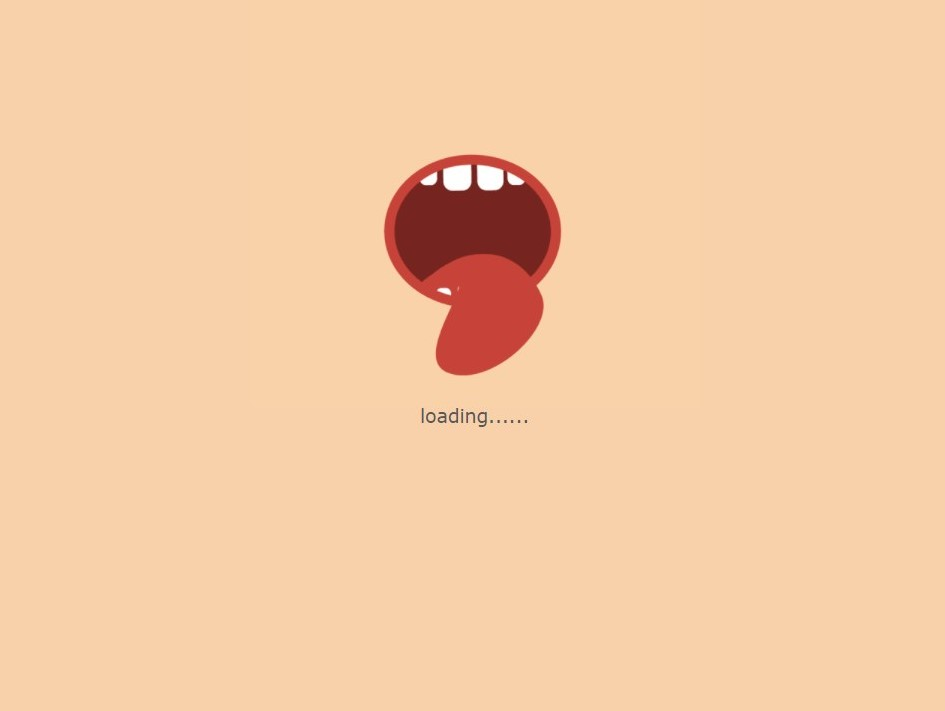

# MOFF 美食模擬點餐網頁
希望忙碌的人們也能吃到想吃的美食，因此有了MOFF美食模擬點餐網頁的誕生!  
為您整合桃園市的優質餐廳，以平價、中價、高價來分類，透過簡潔的圖片與店家連結，讓人們可以快速瀏覽並選擇今天想吃什麼。 
結合外送服務，讓您可以直接在線上訂餐，再忙碌都能品嘗到美味的食物！透過我們的網頁，MOFF將為您實現飯來張口的外送服務!
(此網頁無後台，僅供前台模擬)

# 網址
[👄點我觀看網頁](https://chiatung1010.github.io/moff_orderfoodweb/)

# 畫面
* 等待畫面載入

 

* 進入主畫面，點選store可觀看分類，以平價、中價、高價作為分類

 

* 各分類中皆有餐廳照片提供參考，點選照片可連結至該餐廳的官網或粉專

 

* 點選history觀看製作本網頁的理念、點選map觀看地圖、點選contact可聯繫我們

 

* 點餐畫面

 

# 參考資料
* jquery (https://api.jquery.com/)
